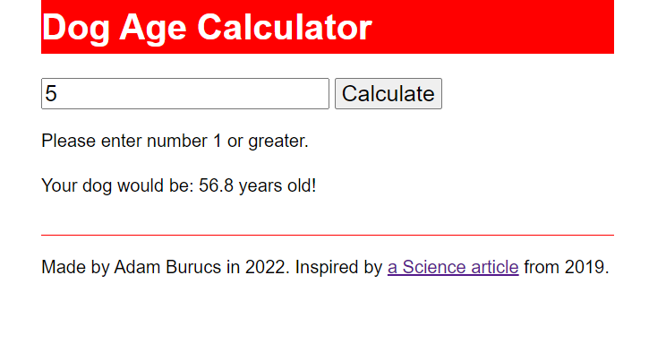

# Dog Age Calculator

This app can calculate the human age of a dog.

## Features

* modern formula based on [a Science article from 2019](https://www.science.org/content/article/here-s-better-way-convert-dog-years-human-years-scientists-say)
* responsive for a wide range of devices
* SCSS styling using custom properties
* vanilla JavaScript using event listeners, query selectors and arrow functions

## Running the app

1. Run `npm install` in root folder
2. Execute `npm run dev` to run in development mode

## Screenshot

The app looks like this.

## License

Please read [the license file.](LICENSE)